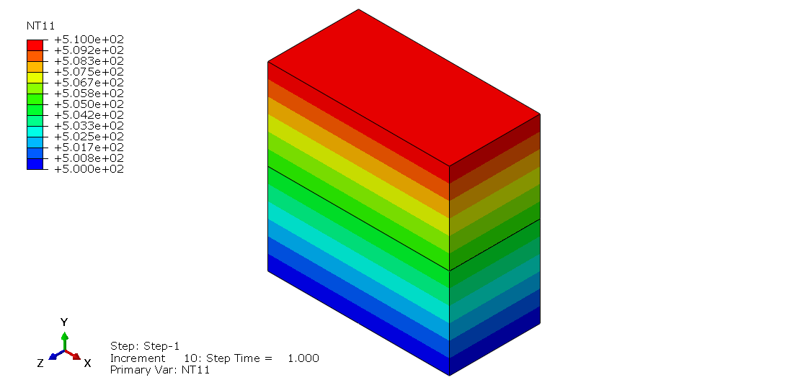

# Lesson 4: Heat Transfer

## Background

A steady-state heat transfer analysis of a unit block is performed. The top edge (B) of the block is prescribed with a distributed flux, while the bottom edge (A) has a prescribed temperature. All other edges are insulated. The thermal conductivity of the block material is $k = 1$. 

The flux associated with conduction across a surface is given by[a](#myfootnote1): 

$q_s = -\bold{n} \cdot \bold{k} \cdot \dfrac{\partial \theta}{\partial \bold{x}}$

where $q_s$ is the surface flux, $\bold{n}$ is the surface normal, $\bold{k}$ is the conductivity tensor, and $\theta$ is the temperature. For our 1-dimensional problem, the above can be reduced to a scalar equation:

$q_s = -k \dfrac{\Delta\theta}{\Delta x} - \left(\theta_A - \theta_B\right)$

since $k = 1$ and $\Delta x = 1$. This gives:

$\theta_B = \theta_A + q_s$. 

which can be used to check the accuracy of the thermal conduction procedure.

## Node definition

Nodes are defined using *NODE:

	*NODE, NSET=GLOBAL
		   1,          0.,          0.,          0.
		   2,         0.5,          0.,          0.
		   3,          1.,          0.,          0.
		   4,          1.,         0.5,          0.
		   5,          0.,         0.5,          0.
		   6,         0.5,         0.5,          0.
		   7,          0.,          0.,        -0.5
		   8,         0.5,          0.,        -0.5
		   9,          1.,          0.,        -0.5
		  10,          1.,         0.5,        -0.5
		  11,          0.,         0.5,        -0.5
		  12,         0.5,         0.5,        -0.5
		  13,          1.,          1.,          0.
		  14,          0.,          1.,          0.
		  15,          0.,         0.5,          0.
		  16,          1.,         0.5,          0.
		  17,          1.,          1.,        -0.5
		  18,          0.,          1.,        -0.5
		  19,          0.,         0.5,        -0.5
		  20,          1.,         0.5,        -0.5

## Element definition

The block is composed of three 8-node brick elements of type DC3D8 (note the D in front). 

	*ELEMENT, TYPE=DC3D8, ELSET=ALL
		  1,      7,      8,     12,     11,      1,      2,      6,      5
		  2,      8,      9,     10,     12,      2,      3,      4,      6
		  3,     19,     20,     17,     18,     15,     16,     13,     14

All the elements are grouped in the element set ALL.		  

## Node groups

We define the group for the nodes at the base of the model on which we will be prescribing the nodal temperatures.

	*************************************************
	** Nodes at the base of the model
	*************************************************
	*NSET, NSET=EDGEA
	1,2,3,7,8,9

## Element groups
	
We create the element groups for the top half and bottom half of the model. These elements will be used to define surfaces for thermal contact and prescribed flux as described in Surface interaction below.

	*************************************************
	** Bottom Blocks
	*************************************************
	*ELSET, ELSET=BOT_BLOCK
	1,2
	*************************************************
	** Top Block
	*************************************************
	*ELSET, ELSET=TOP_BLOCK
	3
		  
## Element property

	*SOLID SECTION,ELSET=ALL,MATERIAL=M1	

## Material definition

The sole material property associated with all elements is the thermal conductivity.

	*MATERIAL,NAME=EQUIL
	*CONDUCTIVITY
	1., 

To make things more interested, we also test the use of a non-conforming mesh where the block is split into top and bottom halves, which are meshed separately and tied together[b](#myfootnote1). 

## Surface interaction

For the interaction properties of the tied surface is specified using *SURFACE INTERACTION:

	*Surface Interaction, name=Thermal_Contact	
	*Gap Conductance
	 1.e6,   0.
	 1.e6,   0.05

The conductance properties of the surface is prescribed using the keyword *GAP CONDUCTANCE. Here, a large thermal conductivity ($1e6$) of the tied surface is specified at zero distance. Note: Abaqus requires two pairs of points are needed; the second line is just a repeat at some nonzero distance away from the surface.
		
## Thermal surfaces

Using the element groups defined earlier, we define the following surfaces:

	************************************************
	** Top surface of top block
	************************************************
	*Surface, type=ELEMENT, name=TOP_BLOCK_TopSurf
	TOP_BLOCK, S5
	************************************************
	** Bottom surface of top block
	************************************************
	*Surface, type=ELEMENT, name=TOP_BLOCK_BotSurf
	TOP_BLOCK, S3
	************************************************
	** Top surface of bottom blocks
	************************************************
	*Surface, type=ELEMENT, name=BOT_BLOCK_TopSurf
	BOT_BLOCK, S5

## Thermal contact
		
The top and bottom blocks are tied together using *CONTACT PAIR:
	
	*Contact Pair, interaction=Thermal_Contact, type=SURFACE TO SURFACE
	BOT_BLOCK_TopSurf, TOP_BLOCK_BotSurf
		
The slave surface is associated with the bottom half and the master surface is associated with the top half of the block.

The block has 1 element at the top half and 2 elements at the bottom half. The base of the block (side A) is prescribed a temperature, which is ramped from 0 to 500 within duration of 1.0. The opposite side (top; side B) of the block has a uniform distributed flux $q_s$, which is prescribed using the keyword *DSFLUX and ramped from 0 to 10 using the keyword *AMPLITUDE.

## Amplitude function definition

We define an amplitude function, named <em> RAMPQ </em>, to ramp the heat flux from $0$ to $10$ from time $0$ to $1$:

	*************************************************
	** Ramp function
	*************************************************
	*AMPLITUDE, NAME=RAMPQ, DEFINITION=TABULAR
	0.,0.,    1.,10.

## Analysis step

Heat transfer analysis is performed using the keyword <em> *HEAT TRANSFER </em> and with the option <em> STEADY STATE </em>. The  time stepping parameters are identical to those used in static analyses (for e.g., see [Lesson 1](./../01_Lesson)).

	*STEP,INC=50
	*HEAT TRANSFER,STEADY STATE
	0.1,1.0,0.25,0.1
	**
	** Prescribed nodal temperature at base of model
	**
	*BOUNDARY
	EDGEA,11,11,500.
	**
	** Prescribed flux at the top surface of the model
	**
	*DSFLUX, AMPLITUDE=RAMPQ, OP=MOD
	TOP_BLOCK_TopSurf,S,1.

The boundary conditions are the nodal temperatures (degree of freedom $11$) of $500$ at the base of the model. The reference value of the heat flux of $1.0$ is prescribed at the top of the model using the keyword <em> *DSFLUX </em>. During analysis, this reference valued will be scaled by the amplitude function <em> RAMPQ </em> defined above.
	
## Viewing results	

After performing the steady-state heat transfer analysis, we can visually check the nodal temperatures of the model.

At the end of the analysis, the prescribed temperature at the base is $\theta_A = 500$ and the prescribed flux at the top is $q_s = 10$. Therefore, the temperature at the top should be $\theta_B = \theta_A + q_s = 510$. The nodal temperatures at the top jibe with this analytical value.

## Exercise 

None

---
## Footnotes

<a name="myfootnote1">a</a>) Abaqus Theory Manual > Procedures > Heat Transfer > Convection/Diffusion

<a name="myfootnote2">b</a>) Ties are typically used to as a convenient means to transition between fine and coarse meshes. 

---
## Additional Comments on This Lesson (Links to Milo)

https://milo.sgh.com/community/software/blog/2019/05/24/elementary-abaqus-heat-transfer-analysis

