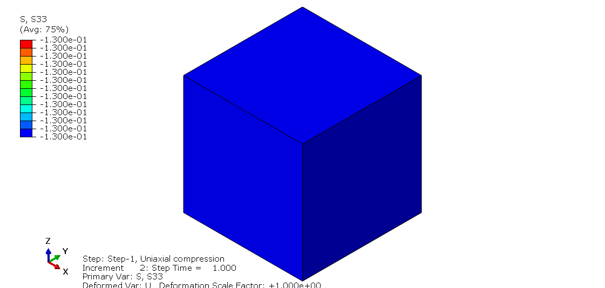
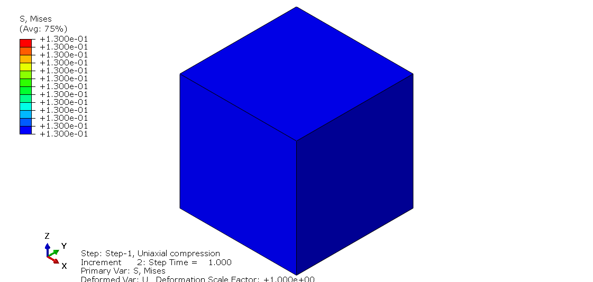
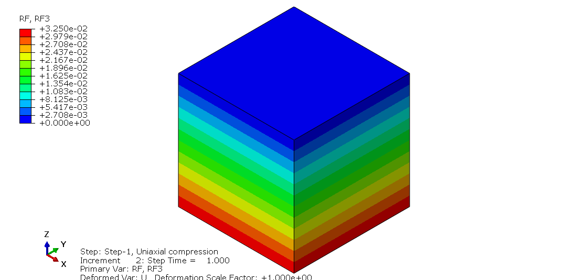

# Lesson 1: Overview of a Model

We will build a single-element model subjected to 1D compression loading. The input file can be found in the "abaqus_input_files" folder above.

## Node definition

The size of the element is 1 x 1 x 1 (a unit cube). The nodes are located at the corners of the cube and can be defined using the keyword <em> *NODE </em>:

	*NODE, NSET=GLOBAL_NSET
	1,          0.,          0.,          0.
	2,          1.,          0.,          0.
	3,          1.,          1.,          0.
	4,          0.,          1.,          0.
	5,          0.,          0.,          1.
	6,          1.,          0.,          1.
	7,          1.,          1.,          1.
	8,          0.,          1.,          1.

The first integer of each line refers to the node label ID. The subsequent real numbers define the , ,  coordinates. As we define the nodes, these are grouped into a node set <em> NSET </em> called <em> GLOBAL_NSET </em>.

## Element type

We will be using a single hex finite element. The element is defined using the nodes through the keyword <em> *ELEMENT </em>:

	*ELEMENT, TYPE=C3D8, ELSET=P1
	1,      1,      2,      3,      4,      5,      6,      7,      8

The element <em> TYPE </em> refers to the element formulation, which in this case is <em> C3D8 </em>[a](#myfootnote1).  

The first integer refers to the element label ID (in this case, specified as 1). Subsequent integers specify the ordering of the nodes of the hex element. As we define the element, it is grouped into an element set <em> ELSET </em> called <em> P1 </em>. 

## Element property

Each element must have an element (section) property[b](#myfootnote1) assigned to it. The element property determines whether you are describing a continuum, or some other structural-type stress-state (e.g., shell, beam, etc.). For the C3D8 hex element, we would need a continuum description, which is specified using keyword <em> *SOLID SECTION </em>

	*SOLID SECTION, ELSET=P1, MATERIAL=M1

We must specify the group of elements <em> ELSET </em> associated with this property, and also the material name <em> MATERIAL </em> (see below).

## Material definition

The material is defined using the keyword <em> *MATERIAL </em>:

	*MATERIAL, NAME=M1
	*ELASTIC
	1000.,0.3

The material is linear elastic, defined using the keyword <em> *ELASTIC </em>. The elastic modulus is  and Poisson's ratio is . We must specify a name for this material (<em> M1 </em>).

## Surface definition
For the purpose of defining a pressure loading on a face of the hex element, we need to first define a surface

	*SURFACE,NAME=TopSurf,TYPE=ELEMENT
	1,S2

Refer to the Abaqus Elements Guide[c](#myfootnote1) to identify the surface ID for the hex element.

## Analysis step definition

We define the analysis step as follows:

	*STEP, NLGEOM=NO, INC=99999999
	Uniaxial compression
	*STATIC
	0.5,1.0,1.e-12,1.0
		...
	*END
	
The option <em> NLGEOM=NO </em> ensures that we are using small-strain formulation, and the number of increments for the entire step <em> INC </em> is set to a very large value (in general, this is to prevent premature termination).

A title of the analysis step is given: <em> Uniaxial compression </em>

We specify a static analysis using the keyword <em> *STATIC </em>. The following line defines the time-stepping characteristics of the analysis step:

	initial time step, total duration of the step, minimum allowable time step, maximum allowable time step

In addition, within the analysis step, we specify:
	
### Boundary conditions

The boundary conditions are such that we have symmetry boundary conditions on the planes ,  and .

	*BOUNDARY
	1,    1
	1,    2
	1,    3
	2,    2
	2,    3
	3,    3
	4,    1
	4,    3
	5,    1
	5,    2
	6,    2
	8,    1	

### Loads

We specify the pressure load of  on the surface <em> TopSurf </em> defined earlier. Positive pressure is in the direction opposite to the surface normal.

	*DSLOAD
	TopSurf,P,0.13

### Output request

We specify the output we require from the analysis:

	*OUTPUT, FIELD
	*NODE OUTPUT
	U,RF
	*ELEMENT OUTPUT
	E,S

In the above, we requested nodal field quantities (displacements <em> U </em>, reactions <em> RF </em>) and elemental field quantities (strains <em> E </em>, stresses <em> S </em>).

## Viewing results

After running the analysis as described in [Lesson 0](./../00_Lesson), we are ready to view the results using Abaqus Viewer. In this lesson, we will verify:

* **Stresses**. The first obvious check that we can make is to confirm that we applied the correct stress value . This can be confirmed by visualizing the stress in the (vertical)  direction , which should be -0.13 (compressive).

	
	
	Other stress quantities can also be checked. For e.g., the von Mises shear stress  should be  since  where  is the maximum principal stress and  is the minimum principal stress; the lateral stress  is zero.
	
	

* **Reactions**. The reactions at the four base nodes are equal to .
	
	
	
* **Displacements**. Since we have a simple linear elastic material and the stress state is homogeneous throughout the element, we can also check the displacements. Since the cube has unit dimensions, the displacement would be equal to the strain. From [linear elasticty](https://en.wikipedia.org/wiki/Linear_elasticity), the vertical strain/displacement is:
		
	

	
	A trite calculation would show that , which agrees with the contour plot below.
	
	
	

## Exercise 

* Define the same 1D compression loading by prescribing displacements on the nodes of the top face. Hint: modify the boundary condition.

* Define the same 1D compression loading using point loads. Hint: use the keyword <em> *CLOAD </em>.

---
## Footnotes
<a name="myfootnote1">a</a>) It is a common misunderstanding that the C3D8 is a fully-integrated element. It uses a selectively-reduced integration scheme to prevent locking. 

<a name="myfootnote1">b</a>) There is a distiction between <em> element type </em> (specified by <em> TYPE </em>) and <em> element property </em> (e.g., specified by <em> *SOLID SECTION </em>). 

<a name="myfootnote1">c</a>) Reference Library > Abaqus > Elements > Continuum Elements > General-purpose continuum elements > Three-dimensional solid element library   