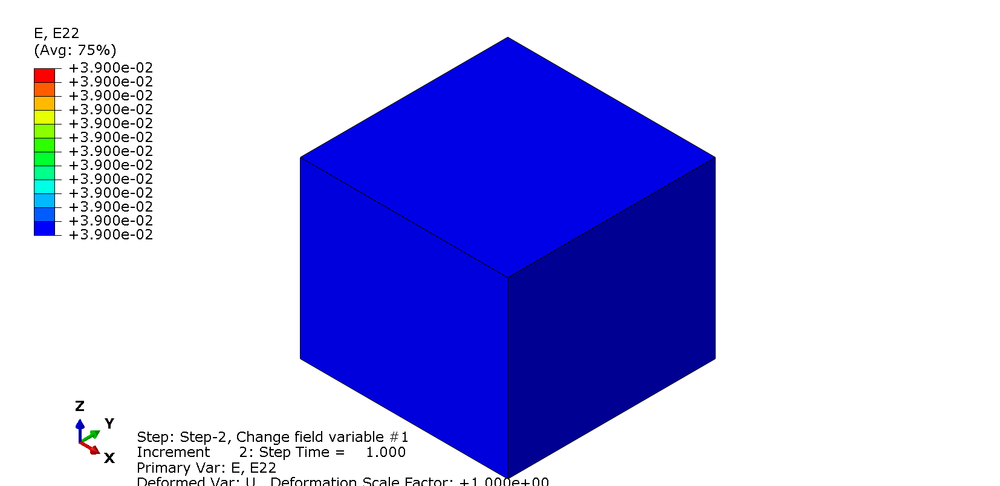
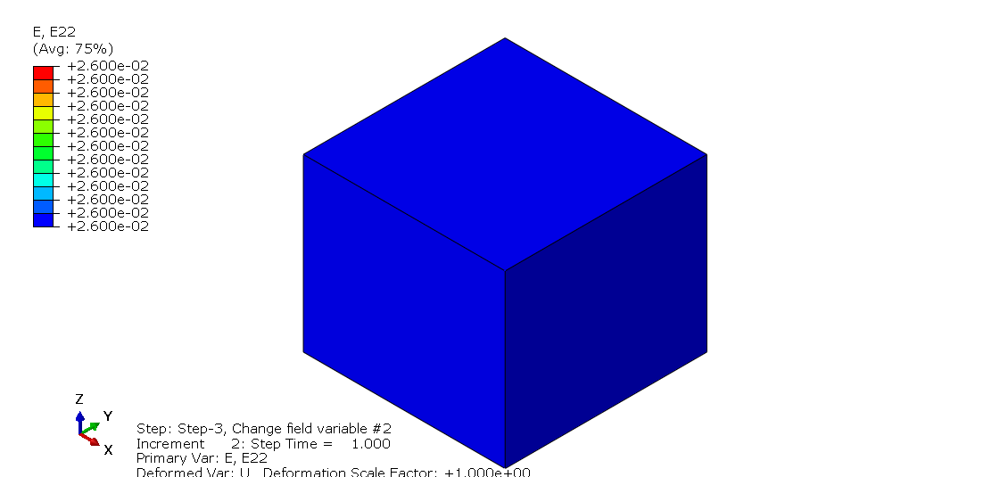

# Lesson 2: Predefined Field Variables

Field variables are typically used to: 

* Indirectly model some prescribed response 
* Control the response of the model in some way to get desired effect

The problem setup (geometry and loading) is identical to that in Lesson 1, with the following exceptions:

## Material definition

The material is defined using the keyword <em> *MATERIAL </em> but this time, ...

	*MATERIAL, NAME=M1
	*ELASTIC,DEPENDENCIES=2
	1000.,0.3,,1.0,1.0
	 100.,0.3,,2.0,1.0
	  10.,0.3,,3.0,1.0
	   1.,0.3,,4.0,1.0
	1000.,0.2,,1.0,2.0
	 100.,0.2,,2.0,2.0
	  10.,0.2,,3.0,2.0
	   1.,0.2,,4.0,2.0

## Initial conditions on field variables

	Initialize field variables #1 and #2. Note that the field variables are initialized at the nodes; each element will then perform an interpolation of the nodal values to obtain the field variable value at the integration points.

	*INITIAL CONDITIONS, TYPE=FIELD, VARIABLE=1
	GLOBAL_NSET,1.0   
	*INITIAL CONDITIONS, TYPE=FIELD, VARIABLE=2
	GLOBAL_NSET,1.0  	   

	
## Analysis steps

	There are a total of 3 steps in this analysis. Step 1 is identical to that in Lesson 1. We define two additional steps to demonstrate how the field variables are used to affect the response of the model.
	
	**********************************************************************
	** Load Step 2
	** Hold displacement and change field Variable #1 from 1.0 to 4.0
	**********************************************************************
	*STEP, NLGEOM=NO, INC=99999999
	Change field variable #1
	*STATIC
	0.5,1.0,1.e-12,0.5
	*FIELD, VARIABLE=1
	GLOBAL_NSET,4.0
	*END STEP
	**********************************************************************
	** Load Step 3
	** Hold displacement and change field Variable #2 from 1.0 to 2.0
	**********************************************************************
	*STEP, NLGEOM=NO, INC=99999999
	Change field variable #2
	*STATIC
	0.5,1.0,1.e-12,0.5
	*FIELD, VARIABLE=2
	GLOBAL_NSET,2.0
	*END STEP

### Output request

	Add output for field variable values:
	
	**********************************************************************
	** Load Step 1 - 1D Compression
	**********************************************************************
	*STEP, NLGEOM=NO, INC=99999999
		...
		...
	*ELEMENT OUTPUT
	E,S
	FV1,FV2	

	The second line is the same as in Lesson 1. In the third line, 
	We define the output request in step 1. This request will be propagated into the following steps.
	
## Viewing results	

* **Field variables**. We can check that the field variables are properly initialized and modified through the steps.

* **Displacements**. As in Lesson 1, the vertical strain after Step 1 (gravity) is .

	In Step 2, the modulus  is dropped from  to  through field variable . Therefore, at the end of Step 2, the vertical strain should be  times larger, at . 	
	Also, the lateral strain  is:
	

	
	where  and .	These values jibe with the contour plots below.
	
	
	
	In Step 3, the modulus  is kept constant, while the Poisson's ratio  is dropped from  to  through field variable . Therefore, at the end of Step 3, the lateral strain is:
	
	

			
	where  and .	These values jibe with the contour plots below.

	

## Exercise 

* The vertical strain  did not change during Step 3. Why? Hint: Calculate  using linear elasticity above.
