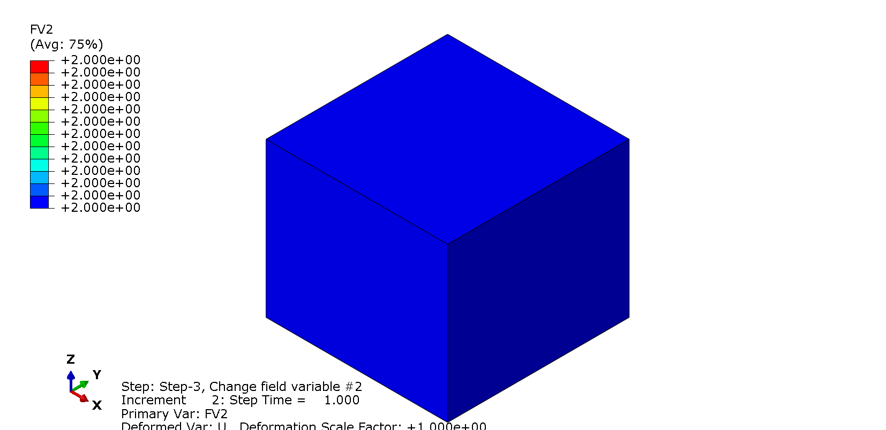

# Lesson 2: Predefined Field Variables

Field variables are typically used to: 

* Change the properties of a material because we know <em> a-priori </em> that this change is going to happen. This change could be due to a chemical or some other process, but we are not modeling this process in Abaqus. Rather, we are specifying the <em> effect </em> of this process on the material properties.

* Control the model to a get desired effect, e.g., turn on or off the effects of certain materials.

The model setup for this lesson is identical to that in [Lesson 1](./../01_Lesson), except we now make the following changes. The input file can be found in the "abaqus_input_files" folder above.

## Material definition

The material is defined using the keyword <em> *MATERIAL </em> but  and  are now made to vary using field variables.

	*MATERIAL, NAME=M1
	*ELASTIC,DEPENDENCIES=2
	1000.,0.3,,1.0,1.0
	 100.,0.3,,2.0,1.0
	  10.,0.3,,3.0,1.0
	   1.,0.3,,4.0,1.0
	1000.,0.2,,1.0,2.0
	 100.,0.2,,2.0,2.0
	  10.,0.2,,3.0,2.0
	   1.,0.2,,4.0,2.0

The number of field variables is specified using the option <em>DEPENDENCIES</em>. The last two columns of the input correspond to the values of field variables #1 and #2, respectively[a](#myfootnote1). 
	
## Initial conditions on field variables

Field variables #1 and #2 need to be initialized since these do not start from zero. Note that the field variables are initialized at the nodes; each element will then perform an interpolation of the nodal values to obtain the field variable value at the integration points.

	*INITIAL CONDITIONS, TYPE=FIELD, VARIABLE=1
	GLOBAL_NSET,1.0   
	*INITIAL CONDITIONS, TYPE=FIELD, VARIABLE=2
	GLOBAL_NSET,1.0  	   
	
## Analysis steps

There are a total of 3 steps in this analysis. Step 1 is identical to that in [Lesson 1](./../01_Lesson). We define two additional steps to demonstrate how the field variables are used to affect the response of the model.
	
	**********************************************************************
	** Load Step 2
	** Change field variable #1 from 1.0 to 4.0
	**********************************************************************
	*STEP, NLGEOM=NO, INC=99999999
	Change field variable #1
	*STATIC
	0.5,1.0,1.e-12,0.5
	*FIELD, VARIABLE=1
	GLOBAL_NSET,4.0
	*END STEP
	**********************************************************************
	** Load Step 3
	** Change field variable #2 from 1.0 to 2.0
	**********************************************************************
	*STEP, NLGEOM=NO, INC=99999999
	Change field variable #2
	*STATIC
	0.5,1.0,1.e-12,0.5
	*FIELD, VARIABLE=2
	GLOBAL_NSET,2.0
	*END STEP

In Step 2, we change field value of field variable #1 from 1.0 to 4.0. In Step 3, we change field value of field variable #2 from 1.0 to 2.0. As you might guess, these changes will affect the strains or displacements; recall that the (gravity) load is constant.

### Output request

Add output for field variable values:
	
	**********************************************************************
	** Load Step 1 - 1D Compression
	**********************************************************************
	*STEP, NLGEOM=NO, INC=99999999
		...
		...
	*ELEMENT OUTPUT
	E,S
	FV1,FV2	

The input line <em> E,S </em> is the same as in Lesson 1. In the following line, we request that the values of field variables #1 and #2 (<em>FV1</em>, <em>FV2</em>) be made available.
	
We define the output request in Step 1. This output request is then propagated into the following steps. 
	
## Viewing results	

* **Field variables**. We can check that the field variables are correctly initialized and modified through the steps.

| End of Step | Field Variable #1 | Field Variable #2 | 
| :---: | --- | --- | 
| 1 |  |  | 
| 2 |  |  | 
| 3 |  |  | 

* **Displacements**. As in Lesson 1, the vertical strain after Step 1 (gravity) is .

	In Step 2, the modulus  is dropped from  to  through field variable . Therefore, at the end of Step 2, the vertical strain should be  times larger, at . 	
	Also, the lateral strain  is:
	

	
	where  and E=1\nu0.30.2\#2E = 1\nu = 0.2\epsilon_{33}\epsilon_{33}N_1,\hdots,N_{nv}nvN_1 \times N_2 \times N_{nv}N_{nv}$ columns. Therefore, if the number of field variables is large, this table becomes quite big. It may be more convenient to actually write a subroutine to vary the field variables (not covered in this training). In most cases, however, one or two field variables are used.

---
## Additional Comments on This Lesson (Links to Milo)
None

