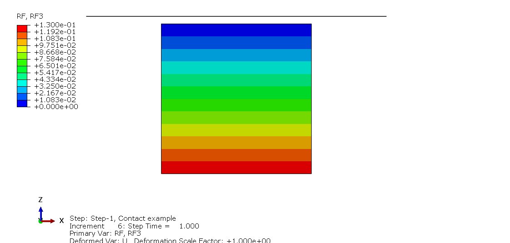

# Lesson 3: Contact Interactions

We build on the cube model described in [Lesson 1](./../01_Lesson). In this lesson, we will add a "table" of thickness 0.1 units on top of the cube (the cube will serve as "a table stand"). 

The following blocks in the input file of [Lesson 1](./../01_Lesson) need to be modified. The modified input file can be found in the "abaqus_input_files" folder above.

## Node definition

Under the <em> *NODE </em> block, we define the additional nodes for the mid-surface of table:

	****
	**** Nodes for mid-surface of "table"
	****
       9,         -0.5,         -0.5,          1.05
      10,          1.5,         -0.5,          1.05
      11,          1.5,          1.5,          1.05
      12,         -0.5,          1.5,          1.05

These nodes define the dimensions of the table to be $2 \times 2$, giving a total area $A = 4$.
	  
## Element definition
		  
Next, we define 1 shell element using the keyword <em> *ELEMENT </em> to represent the table:

	*ELEMENT, TYPE=S4, ELSET=P2
		2,      9,     10,     11,     12	  
		  
Here, we defined 1 shell element of type <em> S4 </em>. In each line, the first integer refers to the element label ID (in this case, specified as 1). Subsequent integers specify the ordering of the nodes of the 4-noded shell element. As we define the element, it is grouped into an element set <em> ELSET </em> called <em> P2 </em>.

## Element property

The required element property is the one that describes a shell-type stress-state. For the <em> S4 </em> hex element, this is specified using keyword <em> *SHELL SECTION </em>. The next required line is the specified shell thickness:

	*SHELL SECTION, ELSET=P2, MATERIAL=M2
	0.1	

## Material definition

The material for the shell elements is defined using the keyword <em> *MATERIAL </em>:

	*MATERIAL, NAME=M2
	*ELASTIC
	1000.,0.3

The material is linear elastic, defined using the keyword <em> *ELASTIC </em>. The elastic modulus is $E = 1000$ and Poisson's ratio is $\nu = 0.3$. We must specify a name for this material (<em> M2 </em>).

## Surface definition

Surfaces are used in contact interactions. Here, we will define the bottom and top surfaces of the table:

	**********************************************************************
	** Define bottom surface of table
	**********************************************************************
	*SURFACE,NAME=BotSurfTable,TYPE=ELEMENT
	P2,SNEG
	**********************************************************************
	** Define top surface of table
	**********************************************************************
	*SURFACE,NAME=TopSurfTable,TYPE=ELEMENT
	P2,SPOS	
	
The top surface will be used for load application, and the bottom surface will be contacting the table top (the top surface of the cube).	

## Contact surface interaction properties

Contact interaction properties for surfaces are needed to define the frictional properties[a](#myfootnote1). We define the contact interaction friction of 0.3 using the keyword <em> *SURFACE INTERACTION </em> and option <em> *FRICTION </em>:

	**********************************************************************
	** Define contact interaction properties
	**********************************************************************
	*SURFACE INTERACTION, NAME=SurfInterProps
	*FRICTION
	0.3
	
## Contact pair definition

The contact pair is defined using using the keyword <em> *CONTACT PAIR </em>:
 
	**********************************************************************
	** Define contact pair
	** slave, master
	**********************************************************************
	*CONTACT PAIR, TYPE=SURFACE TO SURFACE, INTERACTION=SurfInterProps, ADJUST=1.e-3
	TopSurfCube,BotSurfTable
 
Here, the <em> TYPE=SURFACE TO SURFACE </em> option is used. For this type of contact, the thickness of shell elements, if used in the contact pair definition, will be relevant. The interaction <em> SurfInterProps </em> defined above is referenced in the contact pair definition. 

The next line specifies the two surfaces in contact. The slave surface is first specified, followed by the master. Some general guidance on the selection of the slave and master surfaces are given in the footnotes:

## Analysis step definition

The unsymmetric solver must be used[b](#myfootnote1). This is specified using the option <em> UNSYMM=YES </em> on the <em> *STEP </em> line:

	**********************************************************************
	** Load Step 1
	** Note: must use unsymmetric solver because of friction
	**********************************************************************
	*STEP, NLGEOM=NO, INC=99999999, UNSYMM=YES
	
We implement the following boundary conditions and loads:

	*************************
	** Boundary conditions
	*************************
	*BOUNDARY
		1,    1,3
		2,    1,3
		3,    1,3
		4,    1,3
	***
	13,1,2
	*********************************************
	** Apply pressure on top surface of table
	*********************************************
	*DSLOAD
	TopSurfTable,P,0.13	

Here, the base of the cube is fixed against all 3 translations. Furthermore, one corner of the table (node $12$) is fixed against translations in $X$ and $Y$; this is to prevent rigid body motion of the table. The pressure load of $p = 0.13$ is applied on the table top surface.

## Viewing results	

* **Reactions**. We can check that the reactions at the 4 corner nodes at the base of the cube is $\dfrac{p\,A}{4} = 0.13$.

	
## Exercise 

None for this lesson.

[comment]: <> (
What happens when you swap the master and contact surfaces? Do you get convergence? If not, why? Hint: see general guidelines on the selection of slave and master surfaces in the footnotes below.

* Try changing the contact pair option to <em> TYPE=NODE TO SURFACE </em>. What are the things that you need to change in the input file to make the contact work? Subtasks: 

** You need to redefine the table surface using nodes; in <em> *SURFACE </em>, check option <em> TYPE=NODE </em>
** Redefine 
)

---
## Footnotes

<a name="myfootnote1">a</a>) The <em> *SURFACE INTERACTION </em> is a required keyword for contact definition, even if you are considering frictionless contact. In this case, there is <em> *FRICTION </em> line and associated coefficient of friction are not required.

<a name="myfootnote1">b</a>) In Abaqus/Standard the inclusion of friction in a model adds unsymmetric terms to the system of equations being solved. 
 
<a name="myfootnote1">c</a>) General guidelines on the selection of slave and master surfaces:

* If you have a combination of Rigid and deformable bodies, the rigid body should be the master and the deformable should be the slave.

* If both surfaces in a contact definition are deformable, then the softer of the two is the slave and the more stronger is the master.

* The densely meshed body should be the slave. This is because the nodes on the master surface can penetrate into the slave. To avoid too much penetration, the slave meshing must be denser. The coarser mesh is the master.

* The longer of the two surfaces should be the master. This will prevent sliding slave nodes from sliding off from the surface and falling behind. If a slave node falls behind a master, excessive convergence issues occur.

